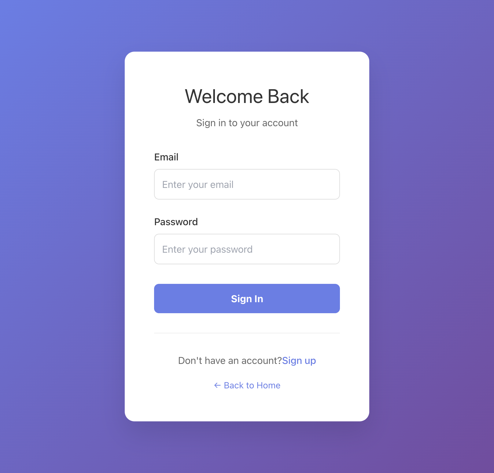
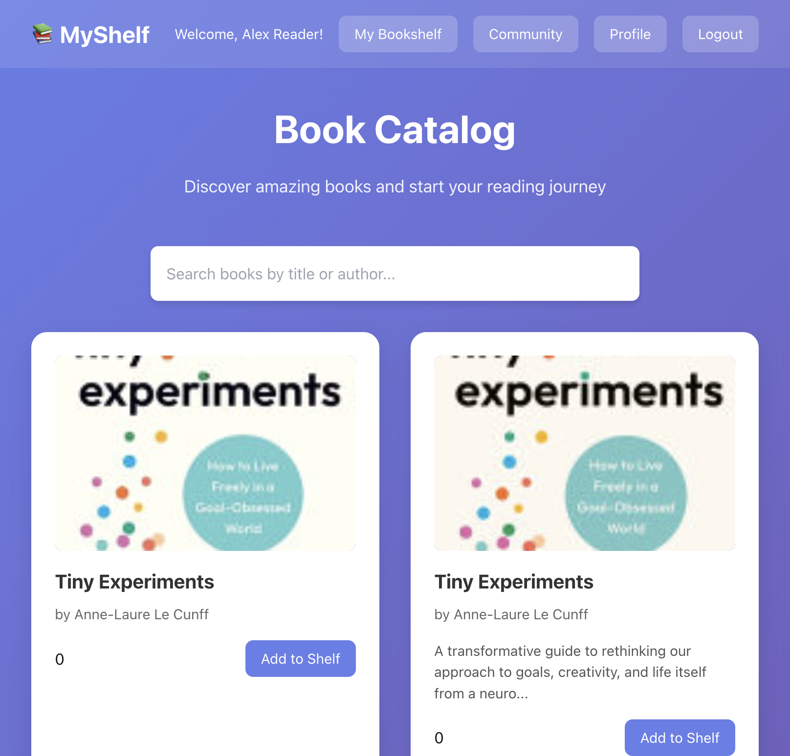
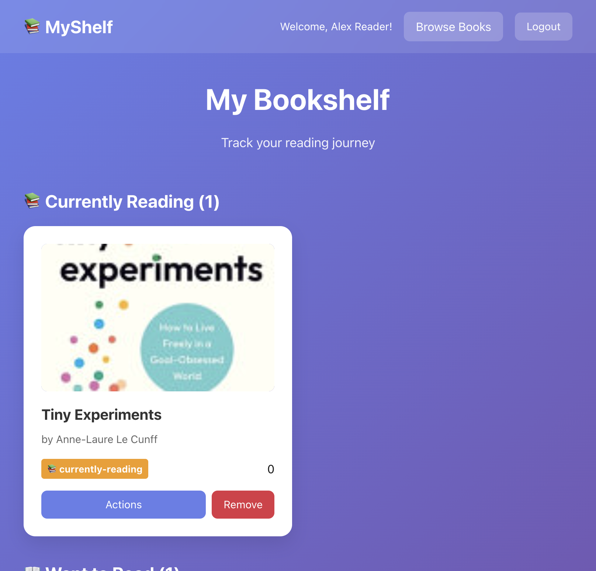
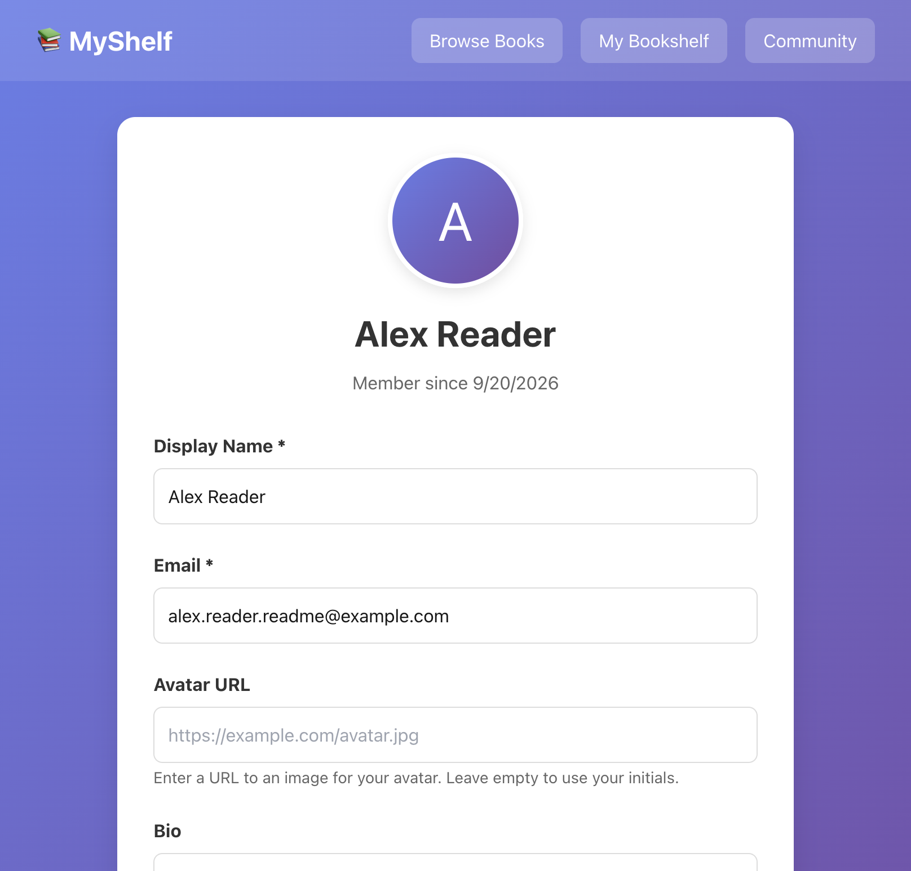
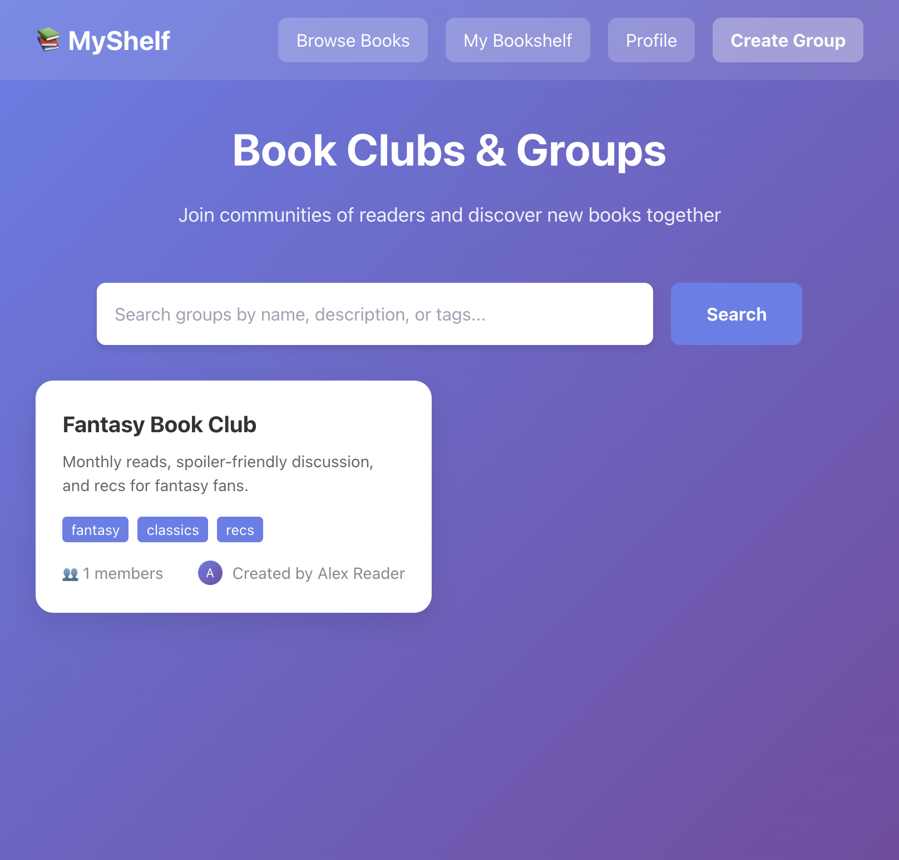
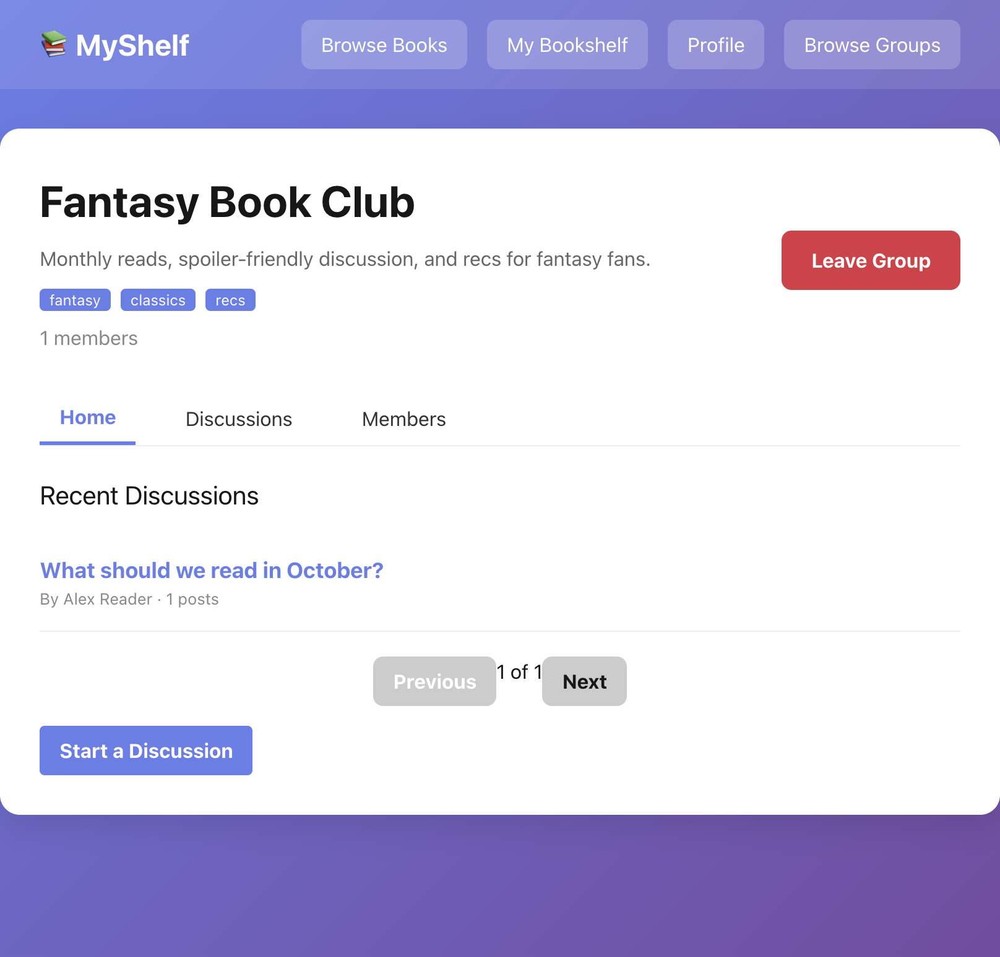
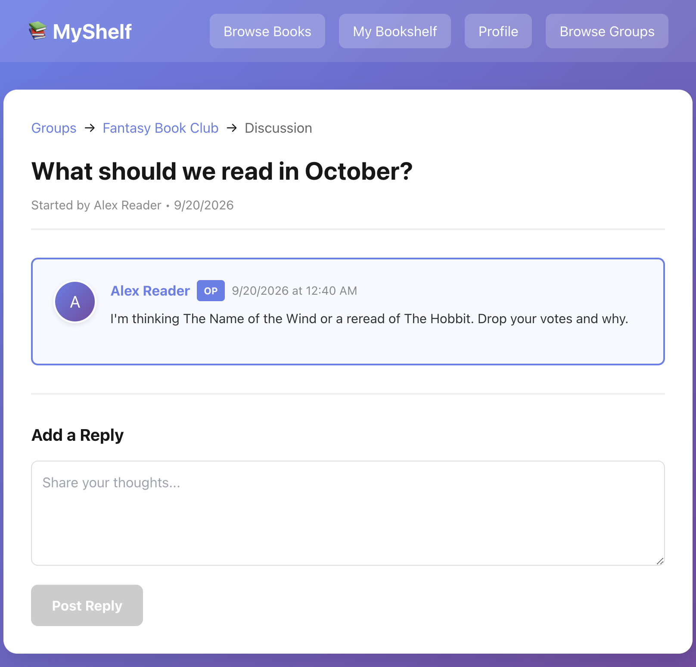

# MyShelf

Full-stack social reading app: catalog + Google Books import, personal shelves, follows, and book-club discussions.

**[Live demo](https://myshelf-nr08.onrender.com/)** · Render free tier — first load can take ~30s

| Layer | Choices |
| --- | --- |
| Frontend | Next.js 15 (App Router), React 19, TypeScript, Zustand, Axios |
| Backend | Node.js (ESM), Express, Mongoose, JWT in httpOnly cookies |
| Data | MongoDB — compound unique indexes, text indexes, aggregation |
| Tests | Jest, Supertest, `mongodb-memory-server` |
| Deploy | Split frontend/backend on Render, credentialed CORS |

---


---

## Product

| Area | What you can do |
| --- | --- |
| Catalog | Browse paginated books; search Google Books and import a result onto the shelf |
| Shelf | Want to read / currently reading / read; rating + review; remove |
| Social | Public profiles, follow/unfollow, view another reader's shelf by status |
| Clubs | Create/join groups, start topics, reply in-thread |

```
Next.js (Render)  --cookie JWT-->  Express API (Render)
                                      |            \
                                      v             v
                                   MongoDB     Google Books API
```

---

## Screenshots

<p>
  
  
</p>
<p>
  
  
</p>
<p>
  
  
</p>
<p>
  
  
</p>

---

## API (authenticated routes marked)

| | Method | Path |
| --- | --- | --- |
| Auth | `POST` | `/api/users/register` · `/login` · `/logout` |
| | `GET` `PUT` | `/api/users/profile` |
| Shelf | `GET` `POST` | `/api/users/bookshelf` |
| | `PUT` `DELETE` | `/api/users/bookshelf/:id` |
| | `GET` | `/api/users/:id/bookshelf` · `/bookshelf/stats` |
| Social | `GET` | `/api/users/:id` · `/followers` · `/following` |
| | `GET` `POST` `DELETE` | `/api/users/:id/follow` · `/follow-status` |
| Books | `GET` `POST` | `/api/books` · `/api/books/import` · `/api/books/search/external` |
| Clubs | `GET` `POST` | `/api/groups` · `/api/groups/:id/join` · `/leave` |
| Topics | `GET` `POST` | `/api/groups/:id/topics` · `/api/topics/:id` · `/reply` |

---

## Run locally

```sh
# API — http://localhost:5000
cd backend
cp .env.example .env   # MONGODB_URI, JWT_SECRET
npm install
npm run dev

# Web — http://localhost:3000
cd frontend
npm install
npm run dev            # NEXT_PUBLIC_API_URL defaults to http://localhost:5000/api
```

```sh
cd backend && npm test
```

`.env.example` keys: `PORT`, `MONGODB_URI`, `JWT_SECRET`, `NODE_ENV`, `CLIENT_URL`.
